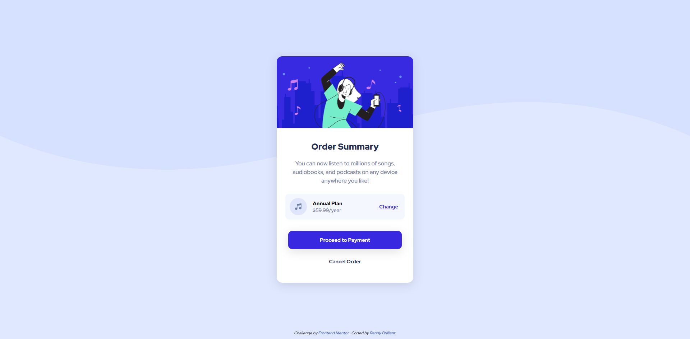

# Frontend Mentor - Order summary card solution

This is a solution to the [Order summary card challenge on Frontend Mentor](https://www.frontendmentor.io/challenges/order-summary-component-QlPmajDUj). Frontend Mentor challenges help you improve your coding skills by building realistic projects.

## Table of contents

- [Overview](#overview)
  - [The challenge](#the-challenge)
  - [Screenshot](#screenshot)
  - [Links](#links)
- [My process](#my-process)
  - [Built with](#built-with)
  - [What I learned](#what-i-learned)
  - [Continued development](#continued-development)
  - [Useful resources](#useful-resources)
- [Author](#author)

## Overview

### The challenge

Users should be able to:

- See hover states for interactive elements
- Be able to view the design in any screen size (responsive)

### Screenshot



### Links

- Solution URL: [https://github.com/RandyBrilliant/order-summary-component](https://github.com/RandyBrilliant/order-summary-component)
- Live Site URL: [https://order-summary-component-tan.vercel.app/](https://order-summary-component-tan.vercel.app/)

## My process

### Built with

- Semantic HTML5 markup
- CSS custom properties
- Flexbox
- Media query

### What I learned

At this project, I try to use semantic HTML5 markup in the webpage, whereas I was exposed to some HTML tag which I think is really powerful such as article, especially the description which change my way in coding a webpage from now on. We can actually injecting more than 1 header/main/footer into a webpage which before I think is impossible.

To see how you can add code snippets, see below:

```html
<dl class="pricing">
  
  <div class="description-group">
    <dt class="pricing-title">Annual Plan</dt>
    <dd class="pricing-desc">$59.99/year</dd>
  </div>
  <button class="btn-link">Change</button>
</dl>
```

I am using a div to group the description title and the description itself as to fulfill the design needs.

### Continued development

There are a lot room of improvement as I am still exploring deep into the HTML and CSS and how we can utilize the maximum capacity of HTML and CSS power in building webpage. As you can see, my CSS file has got bigger as I am still trying find the perfect way in writing less code in CSS. Any feedback and suggestion is welcomed. You can reach me out at my social media stated below.

### Useful resources

- [HTML and CSS: Design and Build Websites 1st Edition](https://www.amazon.com/HTML-CSS-Design-Build-Websites/dp/1118008189) - This book explore HTML and CSS deeper than any other sources that I can find. Probably best resources to start if you just embark to the web development.

## Author

- Linkedin - [Randy Brilliant](https://www.linkedin.com/in/randybrilliant22/)
- Frontend Mentor - [@randybrilliant](https://www.frontendmentor.io/profile/RandyBrilliant)
- Instagram - [@randybrilliant](https://www.twitter.com/randybrilliant)
